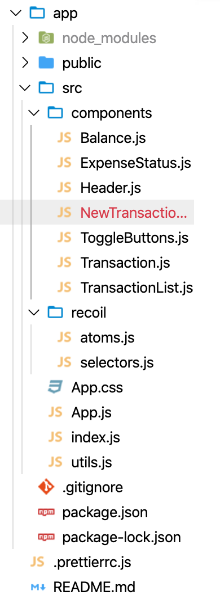

## what is recoilJS?

Recoil is yet another state management library for React. It is maintained and open sourced by Facebook. But why would we need another state management library since we already have so many. Well im not really qualified enough to answer this question so you should go read recoilJS [docs](https://recoiljs.org/). But at least in my eyes recoiljs makes more complex state management simpler. RecoilJS syntax is Reactish as they said in the docs and it almost feels like it´s a part of the React API.

## Building a simple expense tracker

This app is highly based of Brad Traversy´s expense tracker from his vanilla javascript projects. I just thought this would be a good small app that needs some state management. So I will be showing you how to implement this fun little app using React with Recoiljs.

This app will consist of components that will be able to:

1. Display transaction items
1. Show balance, expense and income totals
1. Add new transaction that reflects the total amount
1. Delete items
1. Persist to local storage

This tutorial assumes that you have atleast some experience with React Hooks in advance.

**_You can find the code in this Github [Repo](https://github.com/japiirainen/recoilJS-expense-tracker)_**


## So lets start writing it!

first we jump in the root directory and wrap the `<App />` component which will contain everything else with `RecoilRoot`.

_**index.js**_

```jsx
import React from "react"
import ReactDOM from "react-dom"
import App from "./App"
import { RecoilRoot } from "recoil"

ReactDOM.render(
  <React.StrictMode>
    <RecoilRoot>
      <App />
    </RecoilRoot>
  </React.StrictMode>,
  document.getElementById("root")
)
```

So as you can see we add `<RecoilRoot>` component around our whole application. This is like a context provider or a store privider when using redux.

## Atoms

_**atoms.js**_

```jsx
import { atom } from "recoil"

export const transactionListState = atom({
  key: "transactionListState",
  default: [
    {
      id: 1,
      amount: 10,
      text: "Found a 10 dollar bill!",
    },
    {
      id: 2,
      amount: -110,
      text: "New keyboard",
    },
    {
      id: 3,
      amount: 300,
      text: "Sold my old Playstation!",
    },
  ],
})
```

In recoil atoms are units of state. They are updateable and subscribable, which means that when an atom is updated each subscribed component is re-rendered with the new value.
We need give each atom a unique key and set some default value. Just like with the **_useState_** hook. My atom will eventually have an empty array([]) as its default value. I just gave some initial data so it´s easier to understand whats going on :-). If this is not making any sense right now I promise it will soon!

Lets jump into the **_Transaction.js_** component that will contain a single transaction and later we will display many of these in the **_TransactionList.js_** component.

```jsx
import React from "react"

export const Transaction = ({ transaction }) => {
  return (
    <li className={transaction.amount}>
      {transaction.text}
      <span>{transaction.amount}</span>
      <button className="delete-btn">x</button>
    </li>
  )
}
```

Right now we dont have much there just a template ready to take in some data. Next we will display the data I already have inside my **_atom_** from **_TransactionList.js_**!

```jsx
import React from "react"
import { Transaction } from "./Transaction"
import { transactionListState } from "../recoil/atoms"
import { useRecoilValue } from "recoil"

export const TransactionList = () => {
  const transactionList = useRecoilValue(transactionListState)

  return (
    <>
      <h3>Transaction History</h3>
      <ul className="list">
        {transactionList.map(transaction => (
          <Transaction key={transaction.id} transaction={transaction} />
        ))}
      </ul>
    </>
  )
}
```

So if you are familiar with react this will propably look quite similar to what you have previously seen. Here we use **_useRecoilValue_** instead of **_useRecoilState_** becouse we only read the current state of our **_transactionListState_** atom.
Then we just map our array of transactions into the **_Transaction.js_** component and send the data down with props. Lets take a look at the **_NewTransaction.js_** component.

```jsx
import React, { useState } from "react"
import { transactionListState } from "../recoil/atoms"
import { useSetRecoilState } from "recoil"
import { v4 as uuidv4 } from "uuid"

export const NewTransaction = () => {
  const [textValue, setTextValue] = useState("")
  const [amount, setAmount] = useState(0)
  const setTransactionList = useSetRecoilState(transactionListState)

  const NewTransaction = e => {
    e.preventDefault()
    setTransactionList(oldTransactionList => [
      ...oldTransactionList,
      {
        id: uuidv4(),
        amount: +amount,
        text: textValue,
      },
    ])
    setTextValue("")
    setAmount(0)
  }

  const handleTextValue = e => {
    setTextValue(e.target.value)
  }
  const handleAmount = e => {
    setAmount(e.target.value)
  }

  return (
    <>
      <h3>Add new transaction</h3>
      <form>
        <div>
          <label htmlFor="text">Description</label>
          <input value={textValue} onChange={handleTextValue} />
        </div>
        <div>
          <label htmlFor="amount">
            Amount <br />
          </label>
          <input value={amount} onChange={handleAmount} />
        </div>
        <button onClick={NewTransaction}>Add transaction</button>
      </form>
    </>
  )
}
```

So here we need to be able to add new transaction to our atom that contains the current state of our transactions list. Therefore we use **_useSetRecoilState_** which allows us to do just that! Our **_NewTransaction_** funciton just sets the state to contain all the transactions that were already there and also adding a new item into the list.

And if you were wondering whats going on with **_id: uuidv4()_**, its just a library that generates some random id´s for us!

## Selectors

The second core concept of Recoil is **_Selectors_**. As they state in the docs a selector represents a piece of derived state. You can think of derived state as the output of passing state to a pure function that modifies the given state in some way.
So we need to be able to calculate the total balance based on the current state of our transactionList. This is a perfect place to use a Selector! We will do whis is **_Selectors.js_**

```jsx
import { transactionListState } from "./atoms"
import { selector } from "recoil"

export const balanceState = selector({
  key: "balanceState",
  get: ({ get }) => {
    const transactionList = get(transactionListState)
    const amounts = transactionList.map(transaction => transaction.amount)
    const balance = amounts.reduce((acc, num) => (acc += num), 0).toFixed(2)

    return balance
  },
})
```

Selectors also take in a unique key but they dont have a default value but instead they have get and set properties. We will only need the get property so we´ll focus on that. With the get property we can get the value of some atom and do stuff with it. In our case we use our **_transactionListState_** atom and we want to add together all the amount properties of the transactions.
After the calculation we just return the result and we can use it in our **_Balance.js_** component!

```jsx
import React from "react"
import { useRecoilValue } from "recoil"
import { balanceState } from "../recoil/selectors"

export const Balance = () => {
  const balance = useRecoilValue(balanceState)

  return (
    <>
      <h4>Your Balance</h4>
      <h1>{balance}</h1>
    </>
  )
}
```

Quite simple right!:-)

Now lets make one more selector that will allow us to display the total amounts of incomes and expenses.

```jsx
export const expenseStatsState = selector({
  key: "expenseStatsState",
  get: ({ get }) => {
    const transactionList = get(transactionListState)
    const amounts = transactionList.map(transaction => transaction.amount)
    const income = amounts
      .filter(num => num >= 0)
      .reduce((acc, num) => (acc += num), 0)
      .toFixed(2)

    const expense =
      amounts.filter(num => num < 0).reduce((acc, num) => (acc += num), 0) *
      -(1).toFixed(2)

    return {
      income,
      expense,
    }
  },
})
```

Lets use it in **_ExpenseStatus.js_**. We access the value a bit differently now since we returned an object that contains two values so we use the deconstructoring syntax.

```jsx
import React from "react"
import { useRecoilValue } from "recoil"
import { expenseStatsState } from "../recoil/selectors"

export const ExpenseStatus = () => {
  const { income, expense } = useRecoilValue(expenseStatsState)

  return (
    <div className="expense-status-container">
      <div>
        <h4> Income </h4> <p className="money plus">{income}</p>
      </div>
      <div>
        <h4> Expense </h4> <p className="money minus">-{expense}</p>
      </div>
    </div>
  )
}
```

## Removing transactions

We are still missing the ability to remove stuff from our list of transactions so lets make that possible! We already have a delete button inside of our **_Transaction.js_** component so we just need to add some functionality.

```jsx
import React from "react"
import { useRecoilState } from "recoil"
import { transactionListState } from "../recoil/atoms"
import { removeItemAtIndex } from "../utils"

export const Transaction = ({ transaction }) => {
  const [transactionList, setTransactionList] = useRecoilState(
    transactionListState
  )
  const index = transactionList.findIndex(listItem => listItem === transaction)

  const removeTransaction = () => {
    const newList = removeItemAtIndex(transactionList, index)
    setTransactionList(newList)
  }

  const sign = transaction.amount < 0 ? "-" : "+"

  return (
    <li className={transaction.amount < 0 ? "minus" : "plus"}>
      {transaction.text}
      <span>
        {sign}${Math.abs(transaction.amount)}
      </span>
      <button className="delete-btn" onClick={removeTransaction}>
        x
      </button>
    </li>
  )
}

//  helper function for removing a transaction
const removeItemAtIndex = (arr, index) => {
  return [...arr.slice(0, index), ...arr.slice(index + 1)]
}
```

Now we finally use **_useRecoilState_**! As you can see it´s just like using the **_useState_** hook in vanilla React. The reason I need to do **_Math.abs()_** which gives me the absolute value of the number we pass into it is that it makes all the negative numbers positive so the logic for putting the sign ahead of the number doesn´t get messed up.

## Finally!

Lets implement localstorage so all our transactions dont disappear immediately if we reload our page!
We just need to update two of our components to get this working.

Firstly @ **_NewTransaction.js_** we just add this code snippet after our **_NewTransaction_** function to set all transactions that we create to localStorage. We also need to change from using **_useSetRecoilState_** to **_useRecoilState_** since we need to pass our transactionList to localStorage.

```jsx
useEffect(() => {
  localStorage.setItem("TRANSACTION_LIST", JSON.stringify(transactionList))
}, [transactionList])
```

And @**_TransactionList.js_** we switch from using **_useRecoilValue_** to**_useRecoilState_** since if we find some transactions in local localStorage we need to set the list state to match that.

```jsx
import React, { useEffect } from "react"
import { Transaction } from "./Transaction"
import { transactionListState } from "../recoil/atoms"
import { useRecoilState } from "recoil"

export const TransactionList = () => {
  const [transactionList, setTransactionList] = useRecoilState(
    transactionListState
  )
  useEffect(() => {
    setTransactionList(JSON.parse(localStorage.getItem("TRANSACTION_LIST")))
  }, [setTransactionList])

  return (
    <>
      <h3>Transaction History</h3>
      <ul className="list">
        {transactionList !== null &&
          transactionList.map(transaction => (
            <Transaction key={transaction.id} transaction={transaction} />
          ))}
      </ul>
    </>
  )
}
```
